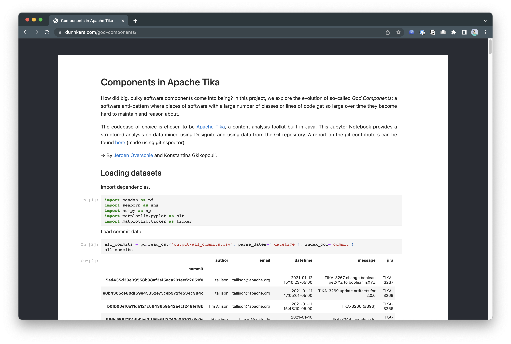
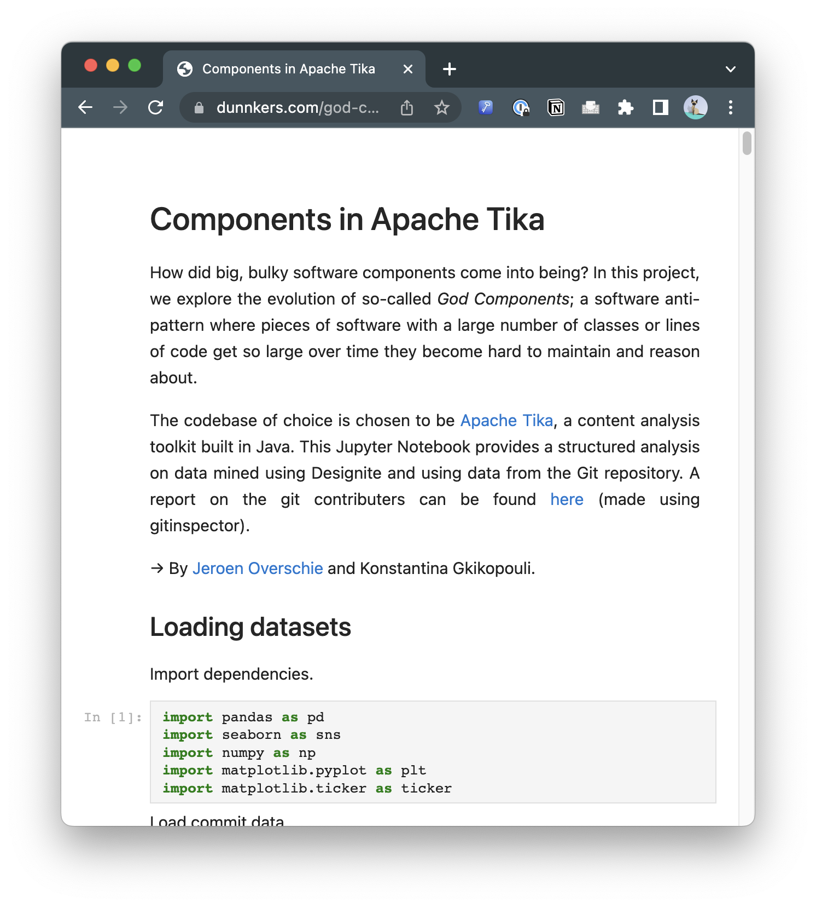

# nbconvert blog template
Custom template for [nbconvert](https://nbconvert.readthedocs.io/en/latest/customizing.html). Adds a background color and centers the Notebook to give it a "blogpost"-like appearance.

Example [webpage](https://dunnkers.com/god-components/):



Mobile version:



Converted using this tool from: [statistics.ipynb](https://github.com/dunnkers/god-components/blob/master/statistics.ipynb)

## Usage
Clone the repo, `cd` inside it and then execute:

```shell
cp -a blog ~/Library/Jupyter/nbconvert/templates
```

... or copy to any other of the template locations. Then, use `jupyter nbconvert` to convert to html:

```shell
jupyter nbconvert somenotebook.ipynb --to html --template blog
```

Alternatively, you could make sure you are in the repo directory, i.e. that the `./blog` folder is present in the current working directory, and then execute `nbconvert`.

## Testing
Run test by running:

```shell
sh blog_test/test_notebook.sh
```

## Configuration
To change the webpage title:

```json
{
    "title": "This title shows up in <title>"
}
```

In the [Notebook metadata](https://ipypublish.readthedocs.io/en/latest/metadata_tags.html#title-page) (put the property at the root json level). Can be accessed in Jupyter Lab using the 'Property inspector' tool, indicated by the gears on the right side of the editor.

More options are also available:

```json
{
    "description": "Is put in a <meta> tag with name='description'",
    "google-analytics-id": "GA-28283819"
}
```

## Author
Hi! 👋🏻 I am [Jeroen Overschie](https://dunnkers.com).